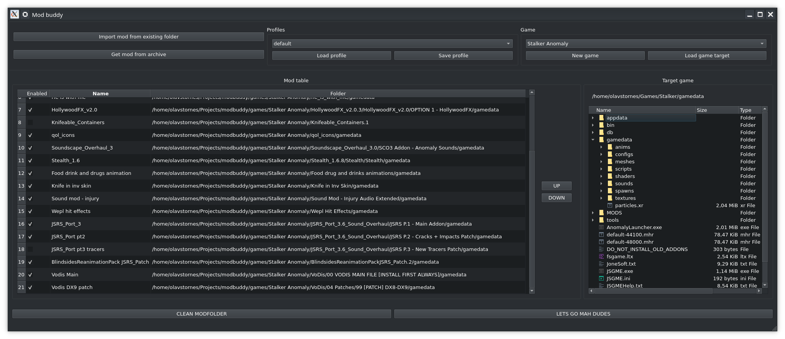
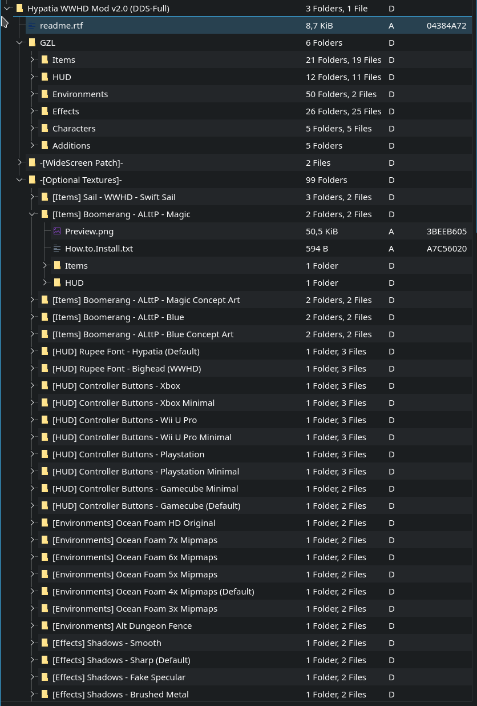
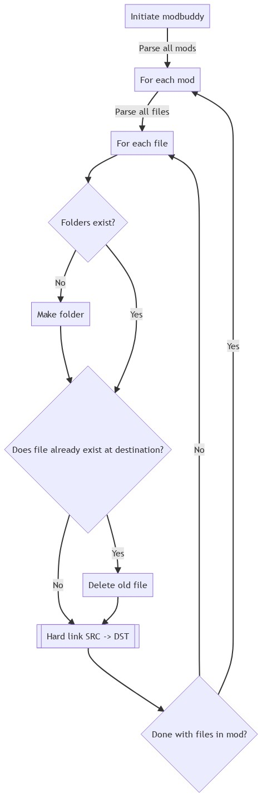
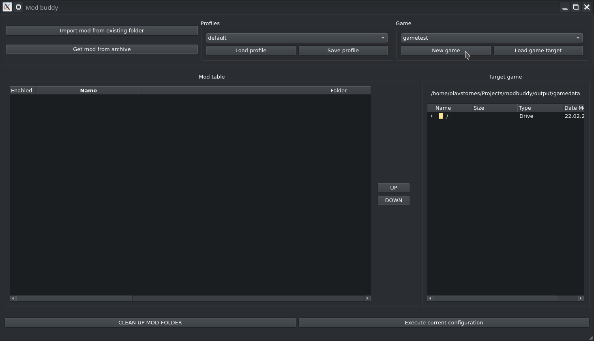
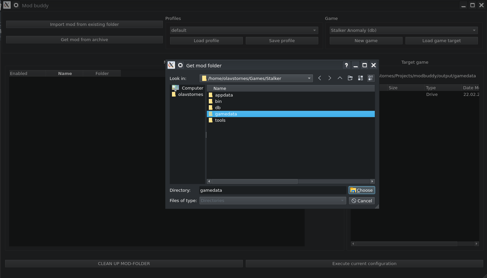

# Mod buddy

After attempting to mod Stalker Anomaly, i had issues finding good tools for the modding scene in Linux. Instead of merging a large amount of files like a caveman, I attempted to create a good enough tool for my use cases.

## Features

- Apply any mod, regardless of how the folder structure is.
- Applied mods are hard linked, saving space
- Support for an arbitrary amount of games
- Mod presets
- Prioritize mod order

### Future dreams
- Conflict detection
- Revert a modified folder to its unmodded state
- More user friendlyness
- Use relative paths on mod settings

## Cases

To further understand why this exists in the first place, I have some examples where the use case may be clear:

- Texture packs with optional patches

This is one use case i find practical. Rather than merging all the patches i want, i can manage them through Mod buddy by importing each patch as a separate mod.

- STALKER Anomaly

Stalker anomaly has a big variety of addons/mods, and as a lot of the mods overlap with varying grade of compabillity. This workflow is easily manageable as well. Since not all addons have the same file structure ('ROOT/gamedata'), Mod buddy is developed to handle such cases as well.

## Explanation

Modbuddy is leveraging the usage of hard links to both avoid duplicated data and avoid any suprises in regards to the filesystem. This is the main functionality residing in [modpack.py](https://github.com/OlavStornes/ModBuddy/blob/master/modpack.py)

## Usage

- Requirements can be retrieved with `pip install -r requirements.txt`
- Run via `main.py` 

### Set up a game folder

- First you need to set up a destination folder. This is done with the control panel on the upper right ("New Game"). Here you will choose which folder the mods will reside.

### Presets
- When setting up a new game, a default profile is created as well (controls at the top middle). Should you need multiple configurations, this is where you can control this.

### Add mods
Lastly, you add mods via the "Add mods"-group to the top left.

You can add mods from two different ways:
- Add mod from archive: Extract target archive to a folder inside Mod buddy, where you then can choose the folder inside
- Add mod from folder: Choose a folder which contains a mod 
	- This is intended for mods that have multiple patches (such as the texture pack mentioned above) or when the user didn't use the above mentioned button.

## Disclaimer
Before you want to try this out: I'm not a UX-designer, a QT-developer nor a cat. This is a personal project which i have found a practical use for.
